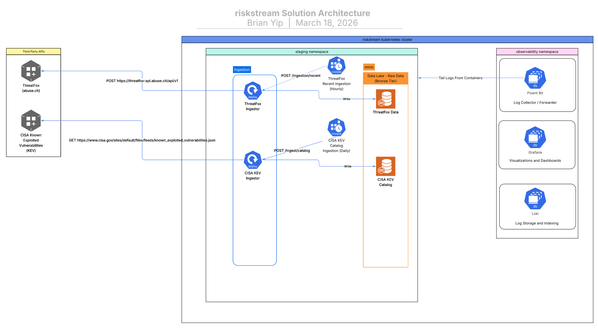

# riskstream

Riskstream is a streaming ML ranking system that prioritizes security signals based on contextual relevance, enabling consumers to focus on the highest-risk threats in near real time.

Built on Kubernetes with Argo CD GitOps and GitHub Actions CI/CD.



Current solution architecture for the project as it exists today. RiskStream is still a work in progress, so this diagram reflects the current state rather than a finalized end state. See [docs/ARCHITECTURE.md](docs/ARCHITECTURE.md) for deployment structure and platform details.

## Quick Start

### Prerequisites

- k3s cluster running locally (`kubectl` context pointing to it)
- `kubectl` and `kustomize`
- Docker (for local builds)

**Note**: MinIO client (`mc`) is NOT required - bucket initialization happens automatically via Kubernetes Jobs using containerized tools.

### Bootstrap Argo CD on k3s

```bash
chmod +x scripts/bootstrap-k3s.sh scripts/port-forward-argocd.sh
./scripts/bootstrap-k3s.sh
```

Access Argo CD:

```bash
./scripts/port-forward-argocd.sh
```

Get initial admin password:

```bash
kubectl -n argocd get secret argocd-initial-admin-secret \
  -o jsonpath="{.data.password}" | base64 -d; echo
```

Visit `https://localhost:8080` (username: `admin`, password from above)

### Local Development

Build and deploy locally to `local-dev` namespace:

```bash
./scripts/build-and-deploy-local.sh
# This script will:
# 1. Build the app and ingestion Docker images
# 2. Import them to k3s
# 3. Deploy all services (including MinIO)
# 4. Initialize MinIO buckets automatically (via Kubernetes Job)
```

Access services:

```bash
# Check pods
kubectl get pods -n local-dev

# Stream logs
kubectl logs -n local-dev -l app.kubernetes.io/name=riskstream --tail=50 -f

# Port forward services
kubectl port-forward -n local-dev svc/riskstream 8081:80

# Port forward MinIO (API on 9000, Console on 9001)
./scripts/port-forward-minio.sh local-dev
# MinIO Console: http://localhost:9001 (login: minioadmin/minioadmin)
```

For the in-cluster ingestion integration test workflow, see [riskstream/tests/integration/README.md](riskstream/tests/integration/README.md).

Clean up:

```bash
kubectl delete namespace local-dev
```

## Contributing

See [CONTRIBUTING.md](docs/CONTRIBUTING.md) for:
- Development setup (Python, VSCode, extensions)
- Local quality checks (Ruff, Black, pytest)
- Pre-push checklist
- CI quality gates

## Roadmap

- [X] GitOps CI/CD (Argo CD + Kustomize overlays)
- [ ] Stream ingestion + normalization
- [ ] Ranking API (baseline)
- [ ] Evaluation + feedback loop
- [ ] Continual training + monitoring

## Documentation

- [**Architecture**](docs/ARCHITECTURE.md) - Kubernetes structure, namespaces, Argo CD behavior, image tagging
- [**CI/CD Pipeline**](docs/CI-CD.md) - GitHub Actions, GHCR, deployment flow
- [**MinIO Storage**](docs/MINIO.md) - Object storage setup, bucket initialization, usage
- [**Contributing**](docs/CONTRIBUTING.md) - Development setup, tooling, quality standards
- [**Service Index**](riskstream/services/README.md) - Entry points to service-specific documentation

## Microservices Architecture

RiskStream is built as a collection of microservices:

- **API Gateway** - Main entry point for external clients
- **Ingestion Services**:
  - **ThreatFox** - abuse.ch ThreatFox IOC ingestion
  - **CISA KEV** - CISA Known Exploited Vulnerabilities catalog ingestion
  - **URLhaus** - abuse.ch recent malware URL ingestion
- **Storage** - MinIO object storage for threat data
  - Separate instances per environment (local-dev, staging, production)
  - Buckets: `threat-indicators`, `raw-feeds`, `processed-data`, `archives`

Service-specific ports, endpoints, schedules, persistence behavior, and troubleshooting live in the individual service READMEs linked from [riskstream/services/README.md](riskstream/services/README.md).

## Tech Stack

| Component | Tool |
|-----------|------|
| Container Orchestration | Kubernetes (k3s for local) |
| GitOps | Argo CD |
| Config Management | Kustomize |
| Registry | GitHub Container Registry (GHCR) |
| CI/CD | GitHub Actions |
| Object Storage | MinIO (S3-compatible) |

## Project Structure

- `app/` - Legacy app kept for the main container image and CI demo flow
- `riskstream/` - Microservice code, shared libraries, and tests
- `docs/` - Cross-cutting architecture, CI/CD, storage, and contributor guidance
- `k8s/` - Kubernetes manifests, overlays, Argo CD definitions, and observability config
- `scripts/` - Local development, deployment, and integration-test helpers

See [docs/ARCHITECTURE.md](docs/ARCHITECTURE.md) for Kubernetes structure and [riskstream/services/README.md](riskstream/services/README.md) for the service index.

## Notes

- **Staging** environment auto-syncs from `main` branch
- **Production** environment requires manual sync for safety
- Demo app in `app/` serves for CI image publishing
- Local development uses `local-dev` overlay to isolate from staging/prod
